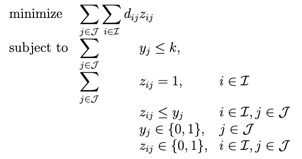

# Vector Quantization via Local Search and Integer Programming for Color Compression

    
    

## Scope

Vector quantization refers to the problem of reducing the memory required to store data by transforming it into a representation which preserves the original information as well as possible. A classic application of this teqchnique is color compression for *RGB images*. In this setting, one is given an image for which each pixel is described by three $8$-bit channels corresponding to red, green, and blue values ranging from $0$ to $255$. Clearly, this requires a total of 24 bits to represent at most $2^{24}$ possible color values. For most images, allocating this much memory is wasteful, as the number of colors actually present is much lower and not all colors are necessary to give a reasonable description of the image. For this reason, we would like to assign each pixel a smaller number of bits (e.g., 3, 8, etc.), thereby yielding an image with potentionally fewer colors that is *"as similar"* as possible to the input image.

We present two approaches for this problem and highlight their interplay. Firstly, we implement [Lloyd's algorithm for k-means clustering](https://en.wikipedia.org/wiki/K-means_clustering#:~:text=k%2Dmeans%20clustering%20is%20a,a%20prototype%20of%20the%20cluster.). Unlike the classic algorithm and its [scikit-learn](https://scikit-learn.org/1.5/modules/generated/sklearn.cluster.KMeans.html) implementation, our algorithm leverages the discrete nature of the input, reducing the data to the set of unique color values present in the image. 

Secondly, we provide an integer programming (IP) formulation for the vector quantization problem. Due to the large number of variables, the naive formulation is not solvable with standard solvers. To overcome this issue, we leverage our local search algorithm to reduce the number of variables, making our program operational.

## Getting started

### Table of contents

* src: folder containing python files;
  * recolor.py: k-means implementation;
  * simplifier.py: module used to reduce the number of IP variables;
  * lp_data_gen.py: script to generate data file for the IP solver;
  * utils.py: module to mange image objects.
* notebook: folder containing a jupyter notebook;
  * results.ipynb: notebook containing the detailed analysis and results breakdown.
* lp: folder containing model, data, and output files for linear integer programming;
  * model.mod: glpk IP model;
  * data.dat: glpk IP data file;
  * objective_value.csv: resulting optimal objective function value;
  * selected_centers.csv: resulting centers selected in the optimal solution;
  * cluster_assignments.csv: resulting assignment of unique data points to selected centers.
* data: folder containing two sub-folders;
  * img: folder containing images in .png format;
  * params: folders containing centers.csv file with center candidates.
* requirements.txt: list of dependencies;
* README.md: this file.

### Prerequisites

* GLPK:
  * `brew install glpk`
  * This will install GLPK on your system, allowing you to solve linear programming and mixed integer programming problems.
* Python virtual environment:
  * On macOS/Linux: 
    `cd your_project_directory`

    `python3 -m venv venv`

    `source venv/bin/activate`
  * On Windows:
    `cd your_project_directory`
    `python -m venv venv`
    `venv\Scripts\activate`
* Python modules:
    `pip install -r requirements.txt`

### Installation

`git clone https://github.com/MateiCosa/vector-quantization.git`

### Usage

To use the local search algorithm with $k$ clusters, simply save your image in the **data/img** folder and type:

`python3 src/recolor.py [input_img.png] [output_img.png] [k]`

To construct the GLPK data file, run:

`python3 src/lp_data_gen.py [input_img.png] [k]`

To solve the IP with GLPK, run:

`cd lp`
`glpsol --model model.mod --data data.dat`

Resulting output images will be stored under **data/img**, while resulting IP files (i.e., optimal objective function value, centroids, assignment) will be stored under **lp**.

## Local search: k-means clustering

Given $p$ vectors $x^i \in \mathbb{R}^n$, $i = 1, \dots, p$, and positive integer $k$, we wish to find $k$ centers $C = \\{c^j \in \mathbb{R}^n: j = 1, \dots, k\\}$ and assign each $x^i$ to some $c^j = c(i)$, where $c(i) = \underset{c^j \in C}{\text{argmin}}\left\lVert x^i - c^j \right\rVert_2^2$. The objective is to minimize:

$$
    \sum_i^p \left\lVert x^i - c(i) \right\rVert_2^2
$$

The classical local search algorithm proceeds in the following way:

1. Sample $k$ centroids $c^1, \dots, c^n$ at random from $\\{x^1, \dots, x^n\\}$ and assign $x^i$ to $c(i)$ for every $i \in \\{1, \dots, p\\}$. Let $f := \sum_i^p \left\lVert x^i - c(i) \right\rVert_2^2$;
2. Update $c^j = \frac{1}{d_j} \sum_{i \in Y_j}$, where $Y_j$ is the cluster with center $c^j$ and $d_j = |Y_j|$. Re-assign $x^i$ to $c(i)$ for every $i \in \{1, \dots, p\}$ and let $f' := \sum_i^p \left\lVert x^i - c(i) \right\rVert_2^2$. If $f' = f$ STOP; otherwise set $f = f'$ and repeat step 2.

The most important implementation trick is noticing that that an image described by $l \times h$ pixels most likely has many pixels with the same value. As such, we can first extract the unique pixel values and their counts, then implement the algorithm described above using the unique values and adapting the cost function appropriately. At the end we discretize the result and output the image with the resulting centroid values for the corresponding pixel.

## Integer programming formulation

### Data

Let $\mathcal{I} := \\{1, \dots, p\\}$. Each data point $x^i$, with $i \in \mathcal{I}$, belongs to $R^3$ (i.e. $n = 3$), with each component representing a value for one of the three *RGB channels*. We observe that each center $c^j$ must also correspond to an *RGB value*, i.e. a tuple of 3 bytes representing the value of the red, green, and blue channels. While in the general problem formulation $c^j$ can be any element of $\mathbb{R}^n$, our restricted setting allows us to identify the set of possible centers with the set $\mathcal{J} := \\{j : j = 0, 1, \dots, 2^{24}-1\\}$. Indeed, given an integer $j \in \mathcal{J}$ in binary representation, the number represented by each byte corresponds to the red, green, and blue values. Therefore, given the binary representation $j_2 = (b_{27} \dots b_{20})(b_{17} \dots b_{10})(b_{07} \dots b_{00})$, we define $c_j := ((b_{27} \dots b_{20}), (b_{17} \dots b_{10}), (b_{07} \dots b_{00})) \in \mathbb{R}^3$ for all $j \in \mathcal{J}$. 

Let us then introduce the matrix $D \in \mathbb{R}^{n \times m}$, where $m := |\mathcal{J}| = 2^{24}$. For every $i \in \mathcal{I}$ and for every $j \in \mathcal{J}$, we define $D_{i,j} := d_{ij} = \left\lVert x^i - c^j \right\rVert_2^2$, i.e. the distance from point $x^i$ to center $c^j$.

### Variables

We introduce binary variables $y_j$, with $j \in \mathcal{J}$, such that $y_j = 1$ if and only if $c^j$ is one of the $k$ selected centers. Moreover, we introduce binary variables $z_{ij}$, with $i \in \mathcal{I}$ and $j \in \mathcal{J}$, such that $z_{ij} = 1$ if and only if $x^i$ is assigned to the cluster formed around the center $c^j$. This yields a total number of variables equal to $m(p + 1) = 2^{24}(p + 1)$.

### Model

Using the data and the variables introduced in the previous sections, we are ready to formulate our problem as an Integer Program (IP) in the following way:

    

The objective function represents the total dissimilarity given the distance matrix and the assignment of each data point to a center. Note that since the distance matrix was pre-computed, it is a parameter of the model, meaning the linear structure is preserved. The first constraint ensures that the total number of centers is at most $k$. The second constraint imposes that each point $x^i$ is assigned to exactly one center $c^j$. The third constraint reflects the idea that if $x^i$ is assigned to $c^j$, then the latter must be among the selected centers. Finally, all our variables are binary.

While relatively straightforward, this formulation is not operational due to its large number of variables. The key point lies in the exponentially large number of centers. Is there a way to eliminate centers that yield very large dissimilarity scores? To do this, we can leverage our local search algorithm!

## Local search meets integer programming

We will employ the following $2$-step strategy: 

1. Run k-means with several random initialization and store the best (i.e., lowest) value of the objective function;
2. Generate all possible clusters, find their center, and compute the cost associated to this cluster. If it is greater than the threshold found with our local search approach, then it cannot be among the centers selected in the optimal solution.

A key point has to do with structure of out input data. Since many pixels have the same value, it is enough to look at unqiue color values. If a data point (i.e., color) is assigned to a center, then all the other data points (i.e., pixels) that have the same value will be assigned to the same cluster. 